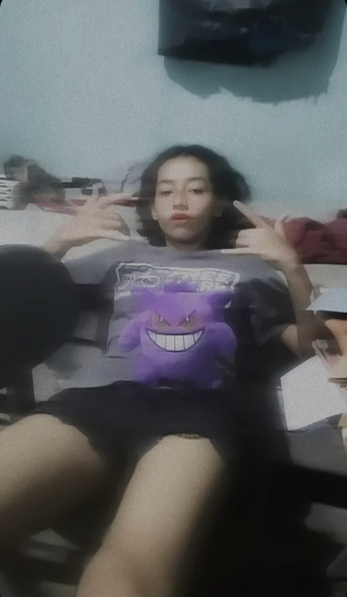

<!DOCTYPE html>
<html id="html">

<body onclick="playAudio()">

    <head>
        <title>blog practico</title>

        <link rel="preconnect" href="https://fonts.googleapis.com">
        <link rel="preconnect" href="https://fonts.gstatic.com" crossorigin>
        <link href="https://fonts.googleapis.com/css2?family=Montserrat:ital,wght@0,100..900;1,100..900&display=swap"
            rel="stylesheet">
        <link rel="stylesheet" href="complement.css">

    </head>

</body id=body>

    <header id="header">
        <h1 id="titulo"> un poco de mi yoli</h1>
        

            block dedicado mi solecito de oscuridad
        

    </header>

    <section id="section">
        <article id="article">
            <h2 id="h2">
                Quien es ella
            </h2>

            

                ella es la persona que puede servir para iluminar un camino, como todos tiene sus cosas buenas y malas,
                pero sobre todo
                aunque le guste esconderlo es una persona que da cariño a la persona que le tiene aprecio, que se hace
                la dura pero tiene corazon de pollito aun que no acepte,
            

            

            

                te quiero perra, desvelada por practicar jskja

            

        </article>
        <article id="article">
            <h2 id="h2">
                como es
            </h2>

            

                es como un minion pasa en su mundo y no sabe que va hacer pero hace lo mejor que se puede,como rapunsel
                el primer wey que ve lo hagarra, como penolope ni ella se entende, como valiente no se deja de nadie
                pero si le das algo lo hace
            

            
            

                buena noche xd

            

        </article>
        <article id="article">
            <h2 id="h2">
                forma de ser
            </h2>

            

                sentida en su buen modo, hace como que no soporta pero de verdad quiere que te quedes alli, no le gusta
                mostrar cariño pero acepta que se lo den, sus gustos musicales son demasiados variados como su animo(mi
                loca vipolar), no le gusta aceptar lo que hace mal, aunque ella sepan que la quieren duda
            

            
            

                yo mimir jksja
            

        </article>
        <article id="article">
            <h2 id="h2">
                como la miran los demas
            </h2>

            

                como una persona nomal talvez rara, igual a los demas sin razon que solo esta, al momento de conocerla
                se veria que tiene su modo feo y cae mal con su falta de interes y solo interesada en si misma que
                deveria cambia.
            

            
            

                cambia con migo no con los otros xd jaja (to es con puntos de vista e)
            

        </article>
        <article id="article">
            <h2 id="h2">
                como yo la miro
            </h2>

            

                como una joven con ganas de seguir aunque exageras sabemos que queres seguir, te miro como alguien unica
                en mi vida porque no soy de tener muchos amigos sercanos y peor tratar como te trato o te cuido, talvez
                tu tambien me quieras como yo a ti pero no es tu estilo interesarse de esa manera(no es justificacion)
                aunque nos tratemos bien de chill sabemos que nos apresiamos,eres bien rara con tus gustos musicales
                entiendo que te gustan varios pero mas raros que yo esos gustos, igual con los hombres sos bien mala pa
                escoger y aunque me tenes a mi para aconsejarte nose si esque no te acuerdas de mi o nose si sabes que
                siempre estoy no cuenta preguntar algo si es bueno o malo
            

            
            

                te quiero aunque todos los consejos que te doy los mandas por el callo
            

        </article>
        <article id="article">
            <h2 id="h2">
                como se deveria ver a ella misma
            </h2>

            

                como una persona unica, hermosa, adivina, tu te devaluas solita y sin razon nunca e escucha alguien
                decirte que eres fea, siempre te crees menos que los demas aunque no sea asi, seria intentar cambiar eso
                para tu propia salud mental, intentar enfocarte en lo que quieres a largo plazo y plantiarte lo que de
                verdad quieres aunque te cueste deverias intentar valorar lo que tienes, no te gustan varias cosas
                (aunque digas que no te importa la opinion de los demas luego te enojas y cambias un rato y luego
                regresa) tu deberias verte como una persona que tiene demasiado valor, aunque no te gusta sabes que la
                mayoria es verdad
                
            

                se tu misma y intenta no encerrarte en una capullo
            

        </article>
        <article id="article">
            <h2 id="h2">
                Avancez de mi solecito
            </h2>

            

                Paso de año y ya va a la mitad de su año estudiando diseño grafico, aunque se mira facil tiene mucha
                creatividad para hacer el menu de packman:
            

            

                
            

            

                con los modelos de restaurantes, casa y todos los vocetos que te a tocado hacer en estos meses y sin
                olvidar al lobito fui fui aunque no eres mucho de cariño te has podido ablandar por lo menos con el y se
                mira que sin importar que, el va ser una persona que deje marca para siempre ya sean cosas buenas o
                malas, te e mirado que has cambiado un poco en actitud te as vuelto mas cariñosa hablan do con el
                *porque con migo ni buenos dias perra, pero asi te quiero
                ❤️*, espero el sea tu chico indicado y si no es pos por lo menos te dejara un buen sabor de boca para
                que sepas que el amor si se puede cultivar y concervar 

            

                

            

        </article>

        <article id="article">
            <h2 id="h2">
                Ya estas cerca de la practica
            </h2>

            

                no te pongas nerviosa yo se que es una cagason pero ten confianza y pon todo de ti para que salga bien,
                ya que este año sales no te presipites a tomar deciciones locas y piensa bien antes de hacer algo
                dratico en tu vida, si vas a la unah pues aya te vere si no pues igual lo que va importar es que te
                guste lo que ayas y donde vallas porque es bueno tener plata pero mejor es disfrutar de lo que haces, y
                recuerda me deves el pollito porque yo entro en enero a la u jsjsjs espero todo te salga muy bien susy
                tu sabes que tienes mi apoyo y mis consejos cuando tu quieras, portate bien no seas la hija de oro se
                sushi pelona jsksjs te quiero amika (se te a olvidado revisar el link e ya van 3 cambios con este pero
                nunca te aviso pa ver xd)

            

            

                

            

        </article>

        <article id="article">
            <h2 id="h2">
                ya pasaste la practica perre
            </h2>

            

                fueron casi 2 meses trabajando con algo que te gusta y segun te en encanto el dia que fui a verte te
                mirabas
                radiante de felicidad por estar ahi y te mirabas como niña en pasillo de muñecas jaja

            

            

                

            

        </article>

        <article id="article">
            <h2 id="h2">
                ya tas cerca de la graduacion y el proxima año veremos que pasa
            </h2>

            

                a pesar de todo te as esforsado yo que se puede ser dificil estar luchando con nvs pero eso es una señal
                para dejarlos por un tiempo
                intenta abrirte un poco con esas personas que te quieren y te valoran aunque creas que no les importas
                por dentro sabes que no es verdad

            

            

                

            

        </article>

        <article id="article">
            <h2 id="h2">
                palabras mias (aqui no pondre foto)
            </h2>
            

                yo se que casi no hablamos pero aun asi te tengo un cariño o mas que un cariño aunque la amitad talvez
                no sea hasta que
                sea el final me rendire yo a ti te quiero y te lo e dicho solo 1 vez en palabras y algunas transmitidos
                por esta mascara wed pero igual
                solo es para que sepas que aunque no hablemos tendras alguien que te apoye desde las sombras como te
                quiero no quiero a nadie mas pelona
                te puedo tratar duro pero a ti no se te puede tratar delicado o por lo menos eso me das a entender solo
                cuidate y te lo digo ahorita sin saber si leeras esto
                sin importar que perro maltido desgraciado te llegues a topar te apoyare pero no me metere amenos que tu
                me lo pidas, solo te me portas bien en estas navidades cuida de susan que tu le puedes meter su buen
                sape
                capas el otro año no lleguemos a hablar mas que este pero bueno como siempre te e dicho yo en el
                trascurso de los meses actualizo esto talvez cosas pequeñas o algunas palabras extra pero igual te
                quiero como si fueras la persona mas cercana mia ❤️
            

            

                por cambio que yo decido hacer ya no te dire perre ni asi por que quiero cambiar la manera, psdt nose si
                te lo avia dicho pero susan si a de saber xd en estos meses ashly a comenzado a interactuar mas con migo
                y si la veo bonita y nose si me gusta pero para mi es bonita sea cual sea el caso (susan solo sabe que
                me gusta alguien no sabe que es ella xd)
            

        </article>

    </section>

<footer id="footer">
    <a id="a" href="#titulo"> ir a arriba </a>
    
 fin 

    <audio id="audio1" loop>
        <source src="Audio/UNO DOS DUKI.mp3" type="audio/mpeg">
    </audio>
</footer>

</body>

</html>
